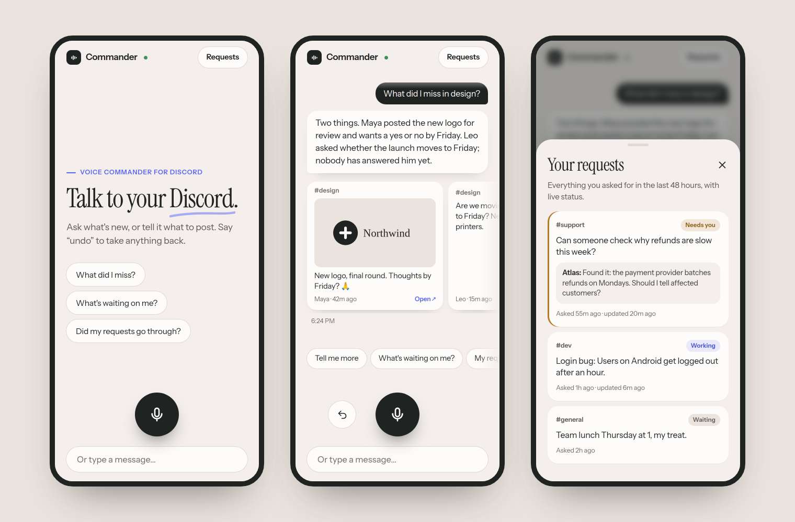

<p align="center"></p>

<h1 align="center">Voice Commander for Discord</h1>

<p align="center"><b>Talk to your Discord.</b><br>
Catch up, post, reply and keep track of your server by voice, hands-free, from your phone.</p>

<p align="center">
  <a href="https://harrythentrepreneur.github.io/discord-voice-commander/">Website</a> ·
  <a href="#quick-start">Quick start</a> ·
  <a href="#safety">Safety</a>
</p>

<p align="center"></p>

---

## What you can say

| Say | It does |
|---|---|
| “What did I miss?” | A short spoken catch-up, with the real messages, images and videos on screen |
| “What's happening in the support forum?” | Finds the room even if you only half remember its name |
| “Tell the team we ship Friday.” | Posts it straight away, under your name |
| “Start a thread in dev about the login bug.” | Opens the thread and adds you to it |
| “Did everything I asked for go through?” | Reads back each request: working, replied, done, or waiting on you |
| “Undo.” | Takes back the last thing it did |

You also get told when someone replies to you. During a call the voice tells you in one sentence. With your phone locked, the bot pings you in Discord instead.

## Quick start

You need **Node 20+**, a **ChatGPT plan** that includes voice, and a computer that stays on.

1. **Create a Discord bot.** In the [Developer Portal](https://discord.com/developers/applications), create an app and add a bot. Copy its token, then invite it to your server with these permissions: View Channels, Read Message History, Send Messages, Send Messages in Threads, Create Public Threads, Manage Webhooks, Add Reactions and Manage Messages.
2. **Install and configure:**
   ```bash
   git clone https://github.com/harrythentrepreneur/discord-voice-commander
   cd discord-voice-commander
   npm install
   cp .env.example .env        # add DISCORD_BOT_TOKEN, DVC_GUILD and DVC_OWNER
   npm i -g @openai/codex && codex login     # your ChatGPT sign-in, used for the voice
   npm start                   # http://127.0.0.1:3077
   ```
   The first start prints an access code and saves it to `.local/access-code`.
3. **Open it on your phone.** Install [Tailscale](https://tailscale.com) on the computer and on your phone, then run:
   ```bash
   tailscale serve --bg --https=8443 http://127.0.0.1:3077
   ```
   Open `https://<computer-name>.<tailnet>.ts.net:8443`, enter the code, and add the page to your home screen. Tap the mic and talk.

To keep it running after a reboot, use a service such as systemd: `ExecStart=/usr/bin/node /path/to/src/server.mjs`, `Restart=always`.

## How it works

```
Phone ──voice──▶ GPT-Live (your ChatGPT sign-in)      ears and mouth only
                     │  "the user asked for something"
                     ▼
              Voice Commander (on your computer) ──▶ brain + Discord tools ──▶ Discord
```

- **GPT-Live** hears you and speaks the answers. It never touches Discord.
- **The app** passes each request to a **brain**: a ChatGPT text model with a small set of narrow Discord tools. It sends each answer back to the exact question it belongs to, so a slow answer is never read out after a newer question.
- **The app, not the model, carries out every write.** It records how to undo each one, and stops the same post going out twice.

An optional second brain runs a [Hermes Agent](https://hermes-agent.nousresearch.com) profile through MCP (`src/mcp.mjs`). See [`hermes-profile/`](hermes-profile/). Pick it with `DVC_BRAIN=hermes`, or switch in the app's Requests sheet.

## Safety

It acts with your bot's permissions, so the guard rails are built into the code, not just the prompt.

- **Private.** It listens on `127.0.0.1` only, and Tailscale makes it reachable from your devices without exposing it to the internet. Every API route needs your access code or your Tailscale login. Five wrong codes lock that address out for 10 minutes.
- **No destructive actions.** It has no tools to delete other people's messages, ban, kick or change roles and permissions. The only delete it can make is undoing its own last action.
- **Only posts when you ask.** Filler and background talk are filtered out. A post goes out straight away only if that sentence asked for one. Anything else waits for a spoken "yes". To require a "yes" for every post, set `DVC_CONFIRM=1`.
- **Your keys stay on your computer.** The bot token and ChatGPT sign-in never reach the browser. It reads `~/.codex/auth.json` and never writes to it. It needs no paid API key.
- **Messages are data.** Text inside Discord messages is never followed as instructions.
- **Hardened page.** The page sets a strict Content-Security-Policy, refuses to be embedded in other sites, uses HttpOnly SameSite cookies (marked Secure over HTTPS), and blocks path traversal.

Check a running server with `npm run security`. Report a vulnerability through a private GitHub security advisory, not a public issue.

## Configuration

Every setting is an environment variable in `.env`. See [`.env.example`](.env.example). The most useful:

| Variable | What it does |
|---|---|
| `DVC_CONFIRM=1` | Ask for a spoken “yes” before every post |
| `DVC_ROOM_WORDS` | Your own product or room names, so “how's Atlas doing?” counts as a Discord question |
| `DVC_WEBHOOK_NAME` | The name shown on posts made through the app |
| `DVC_VOICE` | The GPT-Live voice (default `cove`) |
| `DVC_BRAIN` | `direct` (default) or `hermes` |

Every call is logged to `.local/calls.jsonl`. `node scripts/log-report.mjs 24` summarises the last 24 hours.

## Limits

- **iPhone screen lock:** iOS turns off a web page's microphone about two seconds after the screen locks. Keep the screen on while you talk. Lock-screen pings still reach you through the Discord app.
- **APP badge:** posts show Discord's APP badge, because they are sent by a webhook. Posting as your own user account would be a "self-bot", which breaks Discord's terms, so this project doesn't do it.
- **Bot-made actions:** webhooks can't react, pin or rename, so the bot account does those.

## Development

```bash
npm test                 # 37 unit tests, no network
npm run security         # live security probe against a running server
URL=http://127.0.0.1:3077 node scripts/voice-e2e.mjs question.wav   # a real voice call with a recorded question
```

## License

MIT. Fonts: Instrument Sans and Instrument Serif, SIL Open Font License (see `public/fonts/`). Not affiliated with or endorsed by Discord or OpenAI. Discord is a trademark of Discord Inc.
